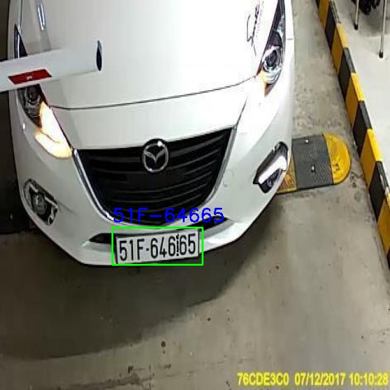
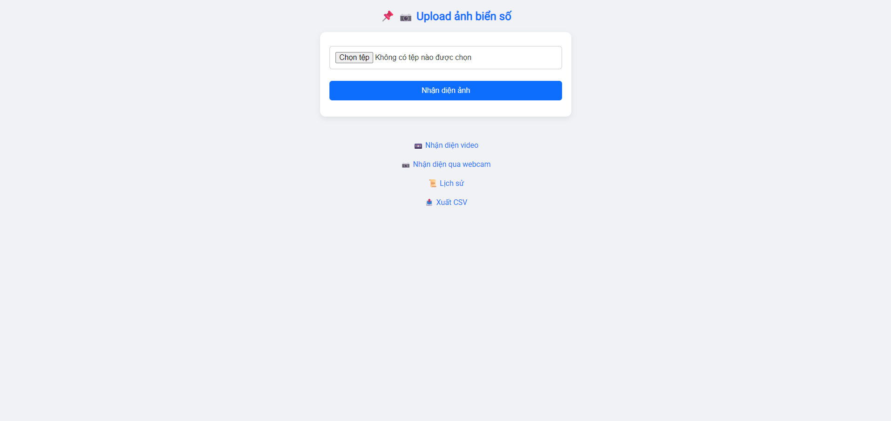
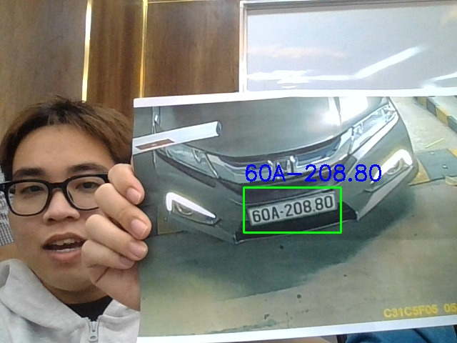

# 🚗 License Plate Detection with YOLOv8x + PaddleOCR

This project is a real-time **license plate detection system** using **YOLOv8x** (Ultralytics) and **PaddleOCR**, with a web-based UI for processing images, videos, and live webcam input.

---

## 📸 Demo Result



> ✅ Detected plate: **51F-64665**

---

## 🌐 Web Interface

Upload image, detect license plate, and get results visually:




---

##  Webcam Interface

Using the device's live webcam, detect license plates and get visual results:



---

## 📁 Project Structure

``` bash
DetectLicensePlateYOLOv8_OCR/
├── static/uploads/ # Uploaded images
├── webcam_recognition.py # Main recognition script
├── plates.db # SQLite database
├── requirements.txt # Python dependencies
├── .gitignore
```

---

## 📥 Download YOLOv8x Model

Due to GitHub's 100MB file size limit, the model file `yolov8x_finetuned.pt` is hosted externally.

➡️ **Download from Hugging Face:**

🔗 [Click to Download yolov8x_finetuned.pt](https://huggingface.co/LePhuocThai003/YoloV8x_finetuned/resolve/main/yolov8x_finetuned.pt)

> 📂 After downloading, place the file in the root directory of the project.

---

## ▶️ How to Run

1. **Install dependencies**:

```bash
pip install -r requirements.txt
```
2. **Run the app:**:

```bash
python webcam_recognition.py
```

---
🔧 Tech Stack
-  YOLOv8x (from Ultralytics).
-  PaddleOCR.
-  OpenCV.
-  SQLite3.
-  Flask (for web UI).
---
🗃️ Database Storage
  This project automatically extracts and stores detected license plates into a local SQLite database (plates.db) for easy lookup and record-keeping.
  
  Each time a plate is detected:
-  The license plate text is extracted using OCR
-  A timestamp is recorded
-  The data is saved into the database
  
  This allows you to:
  
-  View detection history
-  Export results to CSV
-  Track multiple vehicle entries over time

🔍 The database schema can be easily extended to include more fields such as location, confidence score, camera source, etc.

🔧 Example Entry Format:
```bash
Plate Number	             Timestamp
51F-64665	                2025-07-19 10:28:55
```
---

📃 License
MIT License © LePhuocThai2502


